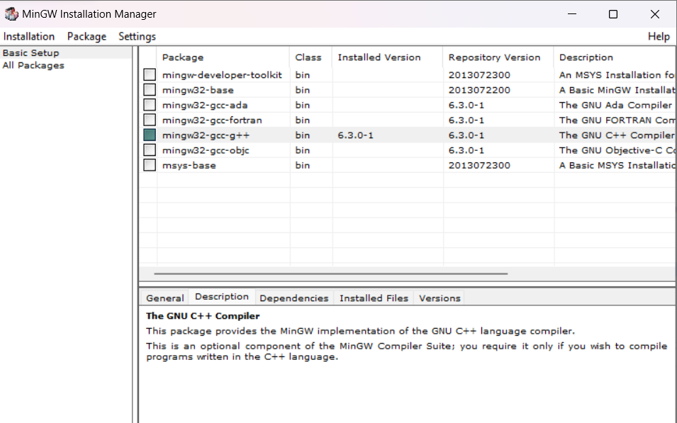
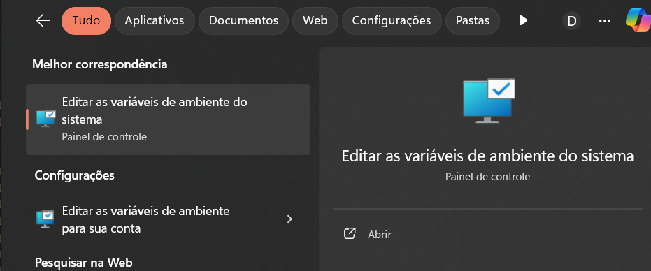
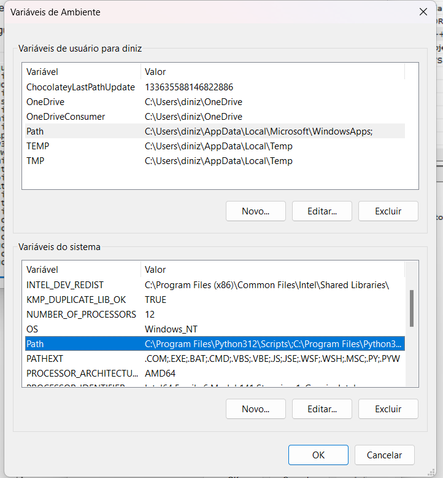
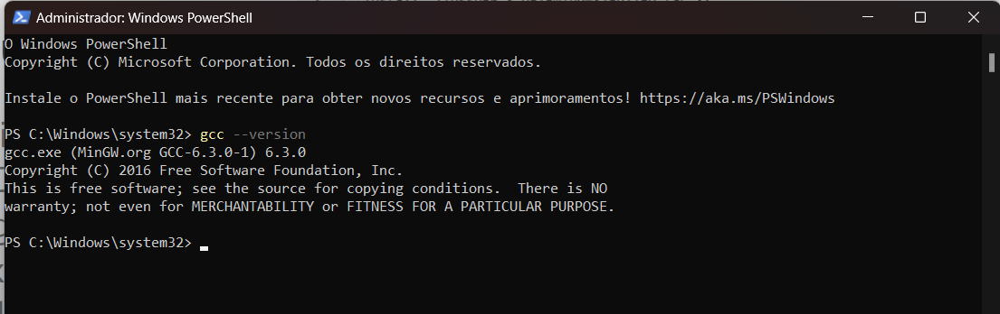

# FIFA Database Project

## Project Description

The FIFA Database Project is a desktop application developed in Java Swing for a user-friendly graphical interface. It allows the manipulation of player data from FIFA 2017 to FIFA 2023 games. This project uses socket communication in Python to interact with a backend developed in the C language for the [File Organization](https://uspdigital.usp.br/jupiterweb/obterDisciplina?sgldis=SCC0215&codcur=55041&codhab=0) course, also offered by our university.

### Features

- **Load data**: loads player data files from FIFA 2017 to 2023.
- **Search**: Search for players using various criteria.
- **View and Edit**: View detailed player information, edit and update records.
- **Delete**: Removes player records from the database.
- **Socket Communication**: The Java GUI connects to a Python server, which communicates with a C program to perform operations on data files.

## How the Project Works

### Overview
The project integrates a Java Swing interface, a Python socket server, and a C backend. Here is how these components interact:

### Graphical User Interface (GUI)
- **Main.java**: Initializes the graphical user interface.
- **FIFAFetch.java**: Manages socket connections for data transmission.
- **FIFAFetchGUI.java**: Manages all user interactions for data manipulation including loading, searching, viewing, editing, and deleting player data.
- **FIFAPlayer.java**: Structures player data for internal operations.

### Server and Communication
- **Socketshandler.py**: Operates the socket server for GUI communications.
- **ClientMessagesHandler.py**: Processes GUI commands and coordinates with the C backend.
- **TrabalhoArquivosHandler.py**: Directly manages file operations based on server requests.

### Data Manipulation
- The C backend directly manipulates player data files, ensuring efficient and secure operations.

### Workflow
1. User actions on the GUI trigger data operation commands.
2. Commands are sent through sockets to the Python server.
3. The server processes these requests, performs file operations, and sends back the results.
4. GUI updates to reflect changes, providing real-time interaction.

This modular architecture enhances system robustness and maintainability.

## Installation

### Requirements

- [Java](https://www.oracle.com/java/technologies/javase-downloads.html) or [OpenJDK](https://openjdk.java.net/)
- [Python](https://www.python.org/)
- [GCC](https://gcc.gnu.org/)
- [Make](https://www.gnu.org/software/make/)

### Linux

Setting up the environment on Linux is straightforward. Please refer to the official documentation or online resources if you encounter any issues.

### Windows

#### Step 1: Install Make

1. Install Chocolatey from [here](https://chocolatey.org/install).
2. Open PowerShell as an administrator and run:

    ```powershell
    choco install make
    ```

3. If Python or OpenJDK/Java is not installed, you can install them via Chocolatey as well.

#### Step 2: Install GCC

1. Download MinGW from [SourceForge](https://sourceforge.net/projects/mingw/).
2. Run the installer as an administrator and follow the installation steps. On the installation manager screen, select the option with `gcc - g++`.

    <p align="center">
      
    </p>

3. Go to the "Installation" menu at the top and click "Apply Changes".

#### Step 3: Configure Environment Variables

1. Search for "Environment Variables" in the Start menu and open it.

    <p align="center">
      
    </p>

2. Click on "Environment Variables".
3. Select the "Path" variable and click "Edit".

    <p align="center">
      
    </p>

4. Add a new entry with the path where GCC was installed, typically: ``C:\MinGW\bin``

5. Confirm the changes. To verify the installation, open PowerShell and run:

    ```bash
    gcc --version
    ```

    <p align="center">
      
    </p>

6. Restart the computer to ensure all changes take effect.

## Usage

### Clone the Repository

1. Use Git Clone or download a zip file
    ```bash
    git clone https://github.com/caue-paiva/trabalho_poo.git
    ```
2. Enter a folder
    ```bash
    cd trabalho_poo
    ```

### Run the Program

#### Linux

1. Build the project
    ```bash
    make
    ```

2. Run the server and interface
    ```bash
    make run
    ```

#### Windows

1. Build the project
    ```powershell
    make
    ```

2. Clean previous builds (important for python socket)
    ```powershell
    make clean
    ```

3. Run the server
    ```powershell
    make run_server
    ```

4. In another PowerShell window, run the interface:
    ```powershell
    make run_interface
    ```

## Project Structure

### Graphical User Interface (GUI)

- Load FIFA data files.
- Search for players by ID, age, name, nationality, and club.
- Display search results and allow selection for detailed view and editing.
- Delete player records.

### Server and Communication

- The GUI connects to a Python server using sockets.
- The Python server translates commands and interacts with a C program to manipulate the data files.
- Each GUI connection has its own copy of the indexed file.

## Important Notes

- The system is designed to run on both Windows and Linux.

## Additional Information

Project developed for the [Object Oriented Programming](https://uspdigital.usp.br/jupiterweb/obterDisciplina?sgldis=SSC0103&codcur=55041&codhab=0) course at the Institute of Mathematics and Computing, University of São Paulo.
